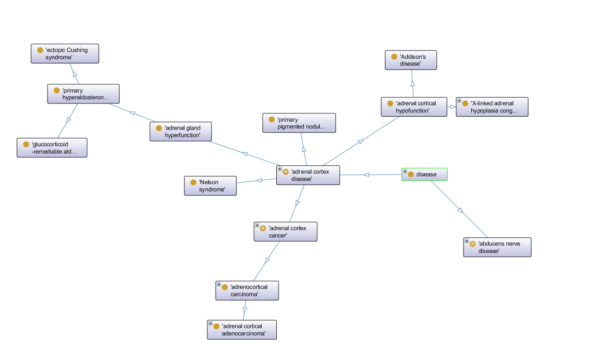
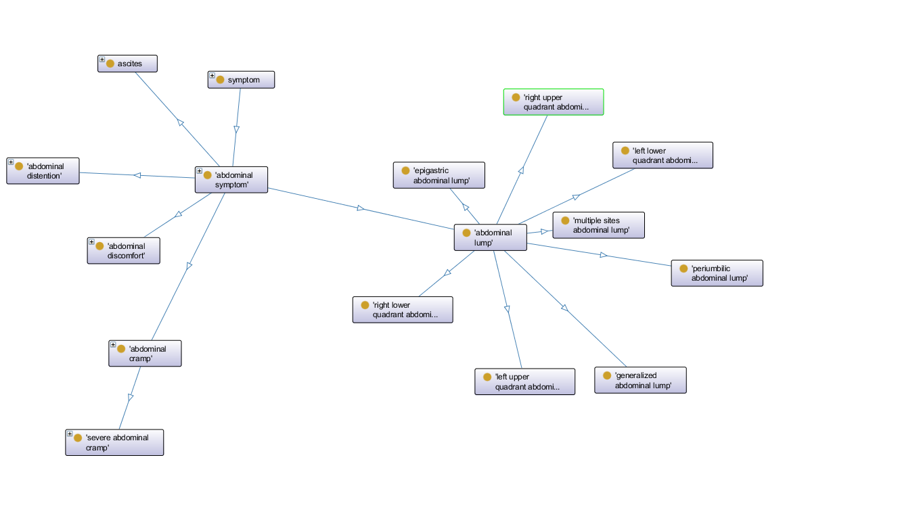
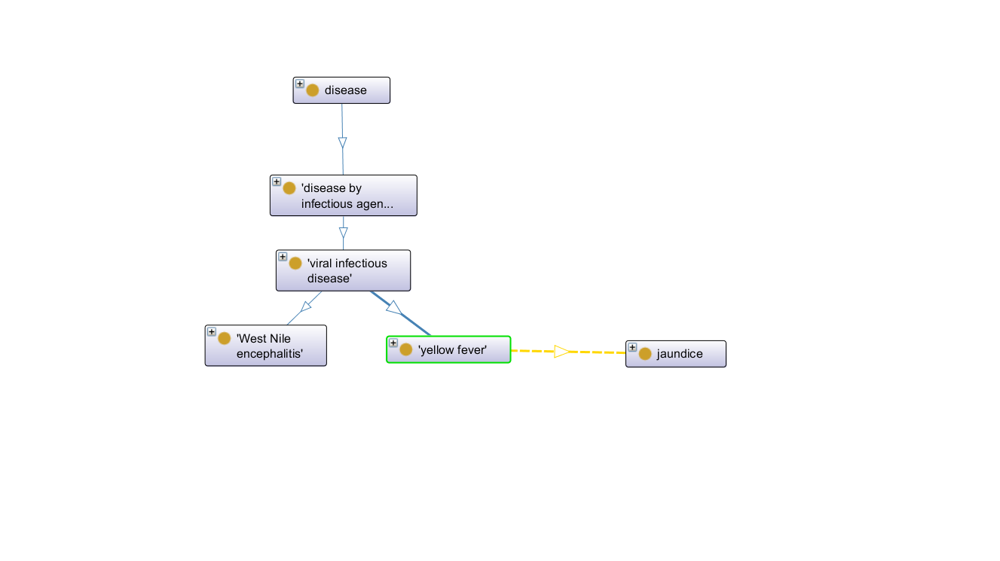
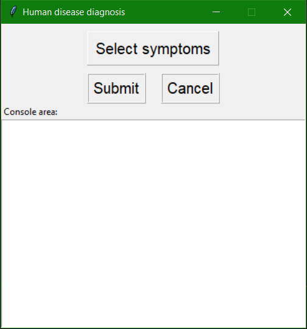
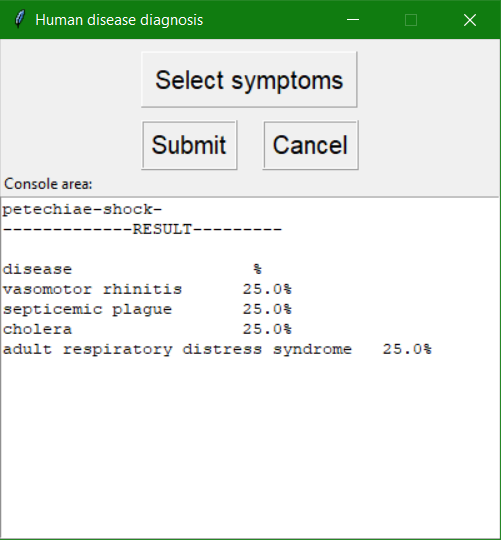

# Report

## Indice

1. [Introduzione](#introduzione)
2. [Modello di dominio](#modello-di-dominio)
3. [Requisiti specifici](#requisiti-specifici)
4. [System Design](#system-design)
	- [Stile architetturale](#stile-architetturale)
	- [Diagramma dei package](#diagramma-dei-package)
	- [Diagramma dei componenti](#diagramma-dei-componenti)
	- [Commenti delle decisioni prese](#commenti-delle-decisioni-prese)
5. [OO Design](#oo-design)
	- [Diagramma delle classi e diagramma di sequenza](#diagramma-delle-classi-e-diagramma-di-sequenza)
	- [Commento delle decisioni prese](#commento-delle-decisioni-prese)
7. [Manuale utente](#manuale-utente)
8. [Processo di sviluppo e organizzazione del lavoro](#processo-di-sviluppo-e-organizzazione-del-lavoro)
9. [Analisi retrospettiva](#analisi-retrospettiva)
	- [Commenti positivi durante il pre post sviluppo](#commenti-positivi-durante-il-pre-post-sviluppo)
	- [Commenti negativi durante il pre post sviluppo](#commenti-negativi-durante-il-pre-post-sviluppo)
	- [Problematiche riscontrate](#problematiche-riscontrate)

<ol>
<li>

## Introduzione

### Human Disease Diagnosis

Human Disease Diagnosis è un’applicazione di diagnosi di malattie con interfaccia grafica (GUI).
* Il modello è un grafo orientato:
  - I nodi sono malattie e sintomi.
  - Gli archi diretti partono dalla malattia per convergere sui sintomi.   
* Ontologia utilizzata (sola lettura) è DOID: Disease Ontology ontologia standardizzata per le malattie umane allo scopo di fornire alla comunità biomedica descrizioni coerenti, riutilizzabili e sostenibili dei termini delle malattie umane e dei relativi concetti di malattie del vocabolario medico.

</li>
<li>

## Modello di dominio

### Diagramma delle classi Disease e Symptom
Per creare la base di conoscenza (KB) le classi prese in considerazione sono state: due Disease e Symptom attraverso la prorpietà 'has_symptom':

* La classe malattia (disease) suddivisa in sottoclassi fino alla foglia che rappresenta la vera malattia. Qui di seguito un esempio di gerarchia di malattie attraverso la proprietà 'has_subclass':

* La classe sintomo (symptom) suddivisa in sottoclassi fino alla foglia che rappresenta il sintomo reale. Qui di seguito un esempio di gerarchia di sintomi attraverso la proprietà 'has_subclass':

* L'arco che le congiunge attraverso la proprietà 'has_symptom'. Qui di seguito un esempio fra 'febbre gialla' (yellow fever) con sintomo (has_symptom) 'itterizio' (jaundice) colorazione giallastra della pelle:

</li>
<li>

## Requisiti specifici

Il sistema software soddisfa i seguenti requisiti.
* Visualizzare la malattia in base ai sintomi inseriti in input da un utente.
* Visualizzare le malattie più probabili in base ai sintomi inseriti in input da un utente.

</li>	
<li>

## System design

### Stile architetturale

### Diagramma dei package

Il sistema software è organizzato secondo il seguente diagramma UML dei **package**:

### Diagramma dei componenti

Il sistema è modellato in termini di componenti e dipendenze tra componenti come mostarto dal seguente diagramma UML dei **componenti**:

### Commenti delle decisioni prese

La fase di design è molto critica infatti le decisioni prese sopra citate sono state fatte per rendere il software estensibile.

</li>
<li>

## OO Design

### Diagramma delle classi e diagramma di sequenza

### Commento delle decisioni prese

Scelte adottate:

</li>
<li>

## Riepilogo del test

## Manuale utente
	
L'applicazione richiede l'utilizzo attraverso un' interfaccia utente (GUI). All'apertura dell'applicazione viene mostrata la seguente finestra:

* Cliccando su 'Select Symptom' viene mostrata una finestra con una lista di sintomi tra cui scegliere.
* Attraverso la console 'Console area' l'utente può visualizzare i sintomi da lui inseriti e successivamente le malattie che potrebbe avere.
* Cliccando su 'Submit' i sintomi scelti dall'utente verranno utilizzati per dedurre le potenziali malattie mostrate a console.
* Cliccando su 'Cancel' verrà cancellato il contenuto della console 

Un esempio di task dell'utente: inseriti i sintomi, a console appaiono le possibili malattie correlate:
 

	

## Processo di sviluppo e organizzazione del lavoro

Lo sviluppo del sistema software è stato eseguito da un team di 3 componenti. Lo stile di processo utilizzato è stato quello **iterativo**: suddividere il progetto in base a sottoinsiemi di funzionaità
(itearazioni). Si è utilizzato **Scrum** un processo di sviluppo agile.

I progressi del progetto sono stati effettuati in una serie di iterazioni detti *sprint*, ogni sprint hanno avuto una durata costante di circa 1 settimana. Ogni sprint aveva una lista di requisiti da sviluppare, le stime di ogni funzionalità sono state stabilite dai membri
del gruppo. Ogni funzionalità è stata trattata come una *user story* ed assegnata ad uno o più membri del team di sviluppo. Qualsiasi membro del team ha potuto aggiungere cancellare e modificare gli elementi.

Ad ogni sprint è stata utilizzata una `scrum board` digitale che riassume lo stato di ogni user story dalla sua nascita (To do) fino alla sua conlusione (Done).

Ogni sprint è stato intodotto da uno `sprint planning` guidato dal **product owner** che sceglieva lo `sprint goal`(obiettivo dell'iterazione). 

Il team successivamente ha creato lo `sprint backlog` in cui si è dato un design preliminare e identificato i task e la loro stima in ore.  Ogni giorno è stato effettuato il `Daily scrum meeting` della durata di 10-15 minuti in cui ogni membro del team ha esposto i suoi problemi e il lavoro fatto precedentemente al meeting e quello
che avrebbe fatto dopo il meeting.
Ad ogni fine iterazione è seguita lo `Sprint review` in cuoi sono stati presentati i risultati raggiunti durante lo Sprint. 

### Lavoro sul codice dell' applicazione

Il workflow utilizzato da ogni membro del team è stato il **Github Flow** in cui sono stati eseguiti i seguenti passi:

**1.** Subito prima di lavorare sul codice, è stato opportuno eseguire una git pull e lavorare sul codice più aggiornato.

**2.** Per ogni nuova feature user story o bug fix è stato creato o scelta l’issue su cui lavorare su GitHub e segnarsi come assigned.

**3.** E' stato creato un nuovo branch sul repository locale con il numero dell'issue o il titolo come nome del branch (issue#n oppure titoloissue) attraverso il comando `git branch <nome branch>`.

**4.** Spostarsi sul nuovo branch appena creato con il comando `git checkout <nome branch>`.

**5.** Lavorare al codice dell’applicazione. Effettuate piccole commit autoconsistenti di volta in volta, con uno scopo ben preciso ed una descrizione dettagliata. Evitando di fare un’unica grande commit alla fine del lavoro, a meno che la feature o il bug fix non sia stato davvero di poco conto.

**6.** Aggiornato con regolarità il branch sul server origin in GitHub con il comando `git push origin <nome branch>`.

**7.** A questo punto, dunque, si è potuto procedere all'apertura di una pull request, andando su GitHub e posizionandosi sul branch su cui si stava lavorando.

**8.** Scritto un titolo conciso ed esplicativo per la pull request e una descrizione significativa per il revisore come commento, incluso un riferimento all'issue nella forma closes #n. Scelto almeno un reviewer tra i componenti del team.

**9.** Discussione di eventuali commenti dei reviewer e apportate le modifiche se necessarie come commit sul branch di lavoro.

**10.** Ricevuta l'approvazione esplicita di almeno un componente del team, si è potuto procedere da GitHub al merge del nuovo branch con il master branch sul repository remoto.

**11.** Se il merge su GitHub è andato a buon fine, per completare il lavoro, è stato cancellato il branch sul repository remoto (mediante interfaccia web di GitHub) e sul repository locale con la sequenza di comandi: `git checkout master, git pull e git branch -d <nome branch>`.

</li>
<li>

## Analisi retrospettiva

### Commenti positivi durante il pre-post sviluppo

### Commenti negativi durante il pre-post sviluppo

### Problematiche riscontrate

</li>
</ol>
