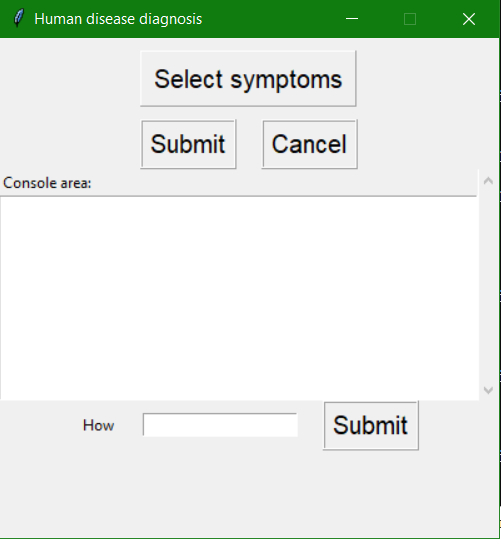
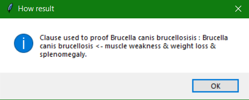
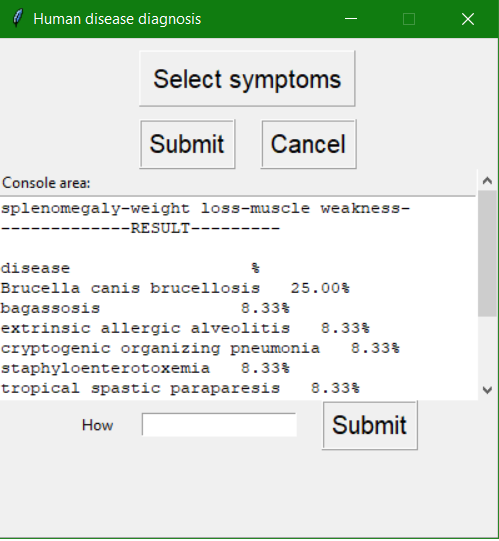

# Report

* Membri del gruppo:
	- Scaringi Raffaele matr.678182
	- Sterlicchio Gioacchino matr.676716
	- Sipone Mirco matr.683254

## Indice

1. [Introduzione](#introduzione)
2. [Modello di dominio](#modello-di-dominio)
3. [Requisiti specifici](#requisiti-specifici)
4. [System Design](#system-design)
	- [Stile architetturale](#stile-architetturale)
	- [Commenti delle decisioni prese](#commenti-delle-decisioni-prese)
5. [Manuale utente](#manuale-utente)
6. [Processo di sviluppo e organizzazione del lavoro](#processo-di-sviluppo-e-organizzazione-del-lavoro)

<ol>
<li>

## Introduzione

### Human Disease Diagnosis

Human Disease Diagnosis è un’applicazione di diagnosi di malattie con interfaccia grafica (GUI).
* Il modello è un grafo orientato:
  - I nodi sono malattie e sintomi.
  - Gli archi diretti partono dalla malattia per convergere sui sintomi.   
* Ontologia utilizzata (sola lettura) è DOID: Disease Ontology ontologia standardizzata per le malattie umane allo scopo di fornire alla comunità biomedica descrizioni coerenti, riutilizzabili e sostenibili dei termini delle malattie umane e dei relativi concetti di malattie del vocabolario medico.

</li>
<li>

## Modello di dominio

### Diagramma delle classi Disease e Symptom
Per creare la base di conoscenza (KB) le classi prese in considerazione sono state due: Disease e Symptom attraverso la proprietà 'has_symptom':

* La classe malattia (disease) suddivisa in sottoclassi fino alla foglia che rappresenta la vera malattia. Qui di seguito un esempio di gerarchia di malattie attraverso la proprietà 'has_subclass':

* La classe sintomo (symptom) suddivisa in sottoclassi fino alla foglia che rappresenta il sintomo reale. Qui di seguito un esempio di gerarchia di sintomi attraverso la proprietà 'has_subclass':

* L'arco che le congiunge attraverso la proprietà 'has_symptom'. Qui di seguito un esempio fra 'febbre gialla' (yellow fever) con sintomo (has_symptom) 'itterizio' (jaundice) colorazione giallastra della pelle:

</li>
<li>

## Requisiti specifici

Il sistema software soddisfa i seguenti requisiti.
* Visualizzare la malattia in base ai sintomi inseriti in input da un utente.
* Visualizzare le malattie più probabili in base ai sintomi inseriti in input da un utente.
* Spiegare come è stata trovata una malattia.

</li>	
<li>

## System design

### Stile architetturale

  * API utlizzate
  
	Al fine di gestire la conoscenza come una KB basata su clausole si è fatto uso delle classi proposte da David L Poole and Alan K Mackworth.
	(Per maggiori informazioni visitare il sito www.aipython.org)
	Le classi utilizzate sono logicBottomUp.py e logicProblem.py
	
	Per l'utilizzo dell'ontologia inferred_doid è stata utilizzata la libreria standard owlready2 di python, la quale fornisce primitive per il caricamento,
	la manipolazione e l'interrogazione di una qualunque ontologia.
	
	Notare che per problemi legati all'uso del reasoner non è stato possibile utilizzare la versione originale.
	Per risolvere questo problema è stato utilizzato Protege. Questa è un'applicazione per la modellazione di ontologie. Essa è stata utilizzata per lanciare il reasoner ed esportare 
	il tutto, al fine di risolvere i problemi legati all'utilizzo del reasoner tramite owlready2.
	
  * Acquisizione dei dati
  
	Per la costruzione della base di conoscenza (oggeto di tipo logicProblem.KB) sono state scritte funzionalità che per l'interrogazione della base di conoscenza (contenute nel file ontology_manager.py), al fine di 
	reperire le malattie con i rispettivi sintomi. Successivamente sono state costruite le clausole (logicProblem.Clause) e quindi la base di conoscenza.
	Notare che, a rigor di logica, la KB sarebbe dovuta essere completata, perché una malattia è caratterizzata da determinati sintomi, ma soprattutto è necessario che tutti gli altri
	non si manifestino. Però ciò avrebbe portato ad un sistema molto selettivo, il quale avrebbe rilevato malattie in molti meno casi, senza tolleranza di errori (esempio: sintomo manifestatosi come falso positivo). Per questo motivo è stato creato un modello
	probabilistico. Per cui ad ogni malattia appartenente al punto fisso della base di conoscenza, è stato assegnato unno score, il quale indica la probabilità che l'utente abbia contratto 
	quella malattia.
	
  * Manipolazione dei dati
  
	Una volta che i dati sono stati acquisiti ed è stata costruita la base, di conoscenza, il sistema è pronto per esser utilizzato.
	Attraverso l'interfaccia grafica l'utente sceglie quali sintomi selezionare, dunque premendo il bottone "Submit" parte il ragionamento.
	Esso consiste nel ritrovamento del punto fisso della base di conoscenza. Dunque viene creato il modello probabilistico e viene stampato a video.

  * Modello probabilistico
  
	Per ragioni già citate nelle sezioni precedenti, è stato ideato un modello probabilistico. Esso assegna ad ogni malattia appartenente al punto fisso uno score tale che esso sia positivo e minore o uguale
	ad 1 e che la somma degli score delle malattie appartenenti al punto fisso sia uguale ad 1.
	
	La probailità calcolata si basa sul numero dei sintomi in comune che ha la malattia presa in considerazione con i sintomi selezionati dall'utente.
	Per cui se denotiamo con S l'insieme dei sintomi che l'utente ha selezionato e con s(m) l'insieme dei sintomi che caratterizzano la malattia, m allora 
	la probabilità che l'utente abbia contratto la malattia m è denotata dalla legge |s(m)|/|S|. Per cui se sono stati inseriti tutti e soli i sintomi che 
	caratterizzano la malattia m, è vero che ciò non esclude il fatto che vengano estratte anche altre malattie, ma sicuramente la probabilità di aver contratto
	la malattia m sarà maggiore o alpiù uguale alla probabilità di aver contratto una qualsiasi altra malattia estratta.
	
  * How question
  
    Sono state implementate funzionalità per la spiegazione dei risultati. In particolare, sono state realizzate funzioni che permettano all'utente di sapere quali siano state le motivazioni del sistema per cui 
	una determinata malattia sia stata rilevata come vera e sia stata comunicata in output all'utente. La metodologia adottata è stata quella delle how questions trattate nel ragionamento con vincoli.
	Per cui si restituisce la clausola utilizzata per dimostrare la malattia richiesta dall'utente.

### Commenti delle decisioni prese

La fase di design è molto critica infatti le decisioni prese sopra citate sono state fatte per rendere il software estensibile.

</li>

<li>

### Manuale utente
L'applicazione può essere eseguita da riga di comando, posizionandosi nella directory scr e digitando "python user_interface.py", oppure sfruttando le primitive di un IDE qualsiasi. 
NB: anche se Python permette la compilazione, generando un eseguibile, ciò non è stato fatto per ragioni di portabilità. 

L'applicazione richiede l'utilizzo attraverso un' interfaccia utente (GUI). All'apertura dell'applicazione viene mostrata la seguente finestra:

* Cliccando su 'Select Symptom' viene mostrata una finestra con una lista di sintomi tra cui scegliere.
* Attraverso la console 'Console area' l'utente può visualizzare i sintomi da lui inseriti e successivamente le malattie che potrebbe avere.
* Cliccando su 'Submit' i sintomi scelti dall'utente verranno utilizzati per dedurre le potenziali malattie mostrate a console.
* Cliccando su 'Cancel' verrà cancellato il contenuto della console
* La parte in basso dell'interfaccia contiene un'area di testo per iserire i sintomi o le malattie per cui si vuole sapere come sono state dimostrate. 
	
	

Un esempio di task dell'utente: inseriti i sintomi, a console appaiono le possibili malattie correlate:
 

	

## Processo di sviluppo e organizzazione del lavoro

Lo sviluppo del sistema software è stato eseguito da un team di 3 componenti. Lo stile di processo utilizzato è stato quello **iterativo**: suddividere il progetto in base a sottoinsiemi di funzionaità
(itearazioni). Si è utilizzato **Scrum** un processo di sviluppo agile.

I progressi del progetto sono stati effettuati in una serie di iterazioni detti *sprint*, ogni sprint hanno avuto una durata costante di circa 1 settimana. Ogni sprint aveva una lista di requisiti da sviluppare, le stime di ogni funzionalità sono state stabilite dai membri
del gruppo. Ogni funzionalità è stata trattata come una *user story* ed assegnata ad uno o più membri del team di sviluppo. Qualsiasi membro del team ha potuto aggiungere cancellare e modificare gli elementi.

Ad ogni sprint è stata utilizzata una `scrum board` digitale che riassume lo stato di ogni user story dalla sua nascita (To do) fino alla sua conlusione (Done).

Ogni sprint è stato intodotto da uno `sprint planning` guidato dal **product owner** che sceglieva lo `sprint goal`(obiettivo dell'iterazione). 

Il team successivamente ha creato lo `sprint backlog` in cui si è dato un design preliminare e identificato i task e la loro stima in ore.  Ogni giorno è stato effettuato il `Daily scrum meeting` della durata di 10-15 minuti in cui ogni membro del team ha esposto i suoi problemi e il lavoro fatto precedentemente al meeting e quello
che avrebbe fatto dopo il meeting.
Ad ogni fine iterazione è seguita lo `Sprint review` in cuoi sono stati presentati i risultati raggiunti durante lo Sprint. 

### Lavoro sul codice dell' applicazione

Il workflow utilizzato da ogni membro del team è stato il **Github Flow** in cui sono stati eseguiti i seguenti passi:

**1.** Subito prima di lavorare sul codice, è stato opportuno eseguire una git pull e lavorare sul codice più aggiornato.

**2.** Per ogni nuova feature user story o bug fix è stato creato o scelta l’issue su cui lavorare su GitHub e segnarsi come assigned.

**3.** E' stato creato un nuovo branch sul repository locale con il numero dell'issue o il titolo come nome del branch (issue#n oppure titoloissue) attraverso il comando `git branch <nome branch>`.

**4.** Spostarsi sul nuovo branch appena creato con il comando `git checkout <nome branch>`.

**5.** Lavorare al codice dell’applicazione. Effettuate piccole commit autoconsistenti di volta in volta, con uno scopo ben preciso ed una descrizione dettagliata. Evitando di fare un’unica grande commit alla fine del lavoro, a meno che la feature o il bug fix non sia stato davvero di poco conto.

**6.** Aggiornato con regolarità il branch sul server origin in GitHub con il comando `git push origin <nome branch>`.

**7.** A questo punto, dunque, si è potuto procedere all'apertura di una pull request, andando su GitHub e posizionandosi sul branch su cui si stava lavorando.

**8.** Scritto un titolo conciso ed esplicativo per la pull request e una descrizione significativa per il revisore come commento, incluso un riferimento all'issue nella forma closes #n. Scelto almeno un reviewer tra i componenti del team.

**9.** Discussione di eventuali commenti dei reviewer e apportate le modifiche se necessarie come commit sul branch di lavoro.

**10.** Ricevuta l'approvazione esplicita di almeno un componente del team, si è potuto procedere da GitHub al merge del nuovo branch con il master branch sul repository remoto.

**11.** Se il merge su GitHub è andato a buon fine, per completare il lavoro, è stato cancellato il branch sul repository remoto (mediante interfaccia web di GitHub) e sul repository locale con la sequenza di comandi: `git checkout master, git pull e git branch -d <nome branch>`.

</li>
</ol>
